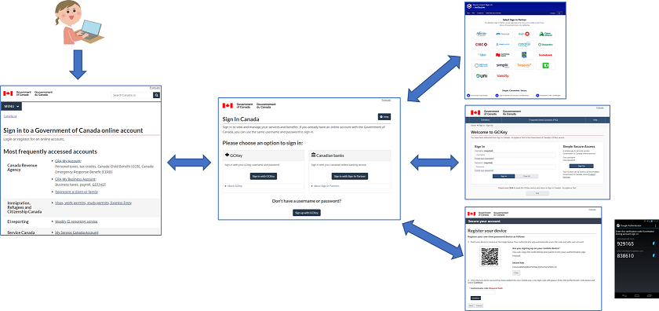

# What is the Sign In Canada Platform?

The Sign In Canada platform provides an umbrella service that acts as a trusted intermediary between
providers of credential services, and government programs who consume them to provide services to their
external clients (e.g., individuals, businesses, and representatives).

## Key Features

* First-factor (username & password) authentication using:
  * The Government of Canada branded credential: [“GCKey”](https://clegc-gckey.gc.ca)
  * Online banking credentials, via a commercial credential broker service (CBS): [“Government Login by Verified.Me”](https://verified.me/government-sign-in-by-verified-me/)
* Second-factor authentication using mobile authenticator apps (e.g., [Google Authenticator](https://play.google.com/store/apps/details?id=com.google.android.apps.authenticator2), [Microsoft Authenticator](https://www.microsoft.com/en-us/security/mobile-authenticator-app))
* [Single Sign-On](session-management.html#single-sign-on)
* [Single (Global) Logout](session-management.html#single-logout)
* Fully customizable user interface (support for "skins")
* [Seamless migration of existing GCKey and CBS users](auto-collection.html)

## Compatibility

Applications integrate with the Sign In Canada platform using the industry standard [OpenID Connect](https://openid.net) protocol. OpenID Connect is widely supported by most major:

* Software-as-a-Service and Platform-as-a-Service cloud products, including
  * [Microsoft PowerApps](https://powerapps.microsoft.com/en-ca/) / [Dynamics 365](https://dynamics.microsoft.com/en-ca/), [SalesForce](https://www.salesforce.com/ca/) and [SAP SuccessFactors](https://www.sap.com/canada/products/human-resources-hcm/hxm-suite.html), and more.
  * [Amazon Cognito](https://aws.amazon.com/cognito/) and [Microsoft Azure Active Directory](../evaluate/b2c.html)
* Application Development platforms, including
  * [ASP.Net](https://dotnet.microsoft.com/en-us/apps/aspnet) ([Core](https://www.nuget.org/packages/Microsoft.AspNetCore.Authentication.OpenIdConnect) & [”Classic”](https://www.nuget.org/packages/Microsoft.Owin.Security.OpenIdConnect/)), [Node.JS](https://www.npmjs.com/package/openid-client), Python/Django, Java EE
* Web Servers, such as  [Apache HTTPD](https://github.com/zmartzone/mod_auth_openidc#readme)

## Learn more

Follow these links to learn more about...

* [The Client Acceptance Test Environment (CATE)](cate.html)
* [The Production Environment](prod.html)
* [Service Management and Support](service.html)
* [Technology and Architecture](technology.html)
