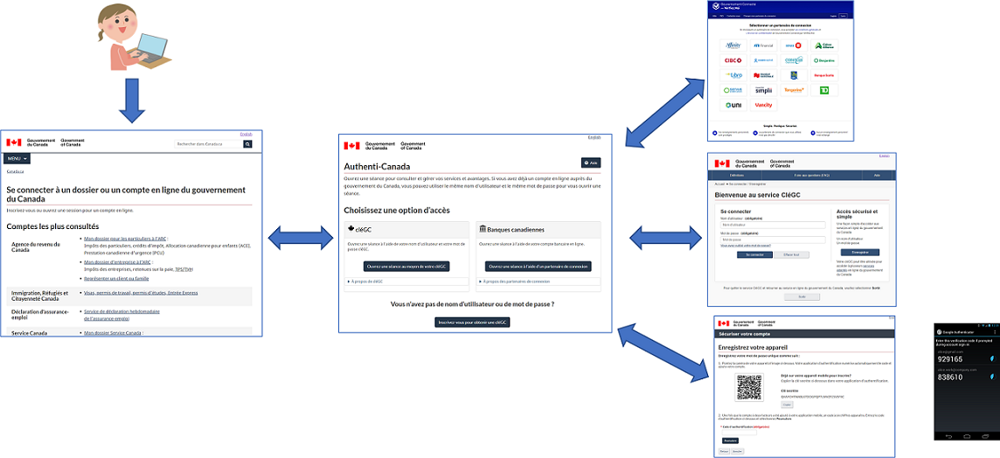

# Qu’est-ce que la plateforme Authenti-Canada?

La plateforme Authenti-Canada fournit un service parapluie qui agit comme un intermédiaire de confiance entre 
les fournisseurs de services d’identification et les programmes gouvernementaux qui les utilisent pour fournir 
des services à leurs clients externes (par exemple, des particuliers, des entreprises et des représentants).

## Caractéristiques principales

* Premier facteur d’authentification (nom d’utilisateur et mot de passe) au moyen:
  * du justificatif portant la marque du gouvernement du Canada: [“CléGC”](https://clegc-gckey.gc.ca)
  * des justificatifs d’identité des services bancaires en ligne, par l’entremise d’un service de courtier de justificatifs d’identité (SCJ): [“Gouvernement Connecté par Vérifiez.Moi”](https://verifiez.moi/gouvernement-connecte-par-verifiez-moi/)
* Deuxième facteur d’authentification à l’aide d’applications d’authentification mobile (par exemple, [Google Authenticator [en anglais]](https://play.google.com/store/apps/details?id=com.google.android.apps.authenticator2), [Microsoft Authenticator [en anglais]](https://www.microsoft.com/fr-ca/security/mobile-authenticator-app))
* [Authentification unique](gestion-des-sessions.html#authentification-unique)
* [Déconnexion unique (globale)](gestion-des-sessions.html#déconnexion-unique)
* Interface utilisateur entièrement personnalisable (prise en charge des "apparences")
* [Migration intégrée des utilisateurs actuels de CléGC et du SCJ](auto-collection.html)

## Compatibilité

Les applications s’intègrent à la plateforme Authenti-Canada en utilisant le protocole normalisé de l’industrie [OpenID Connect (en anglais)](https://openid.net). OpenID Connect est largement pris en charge par les plus importants produits soit:

* Les produits infonuagiques de service comme logiciel (SaaS) et de plateformes en tant que service (PaaS), y compris
  * [Microsoft PowerApps](https://powerapps.microsoft.com/fr-ca/) / [Dynamics 365](https://dynamics.microsoft.com/fr-ca/), [SalesForce (en anglais)](https://www.salesforce.com/ca/) et [SAP SuccessFactors](https://www.sap.com/canada-fr/products/human-resources-hcm/hxm-suite.html), entre autres.
  * [Amazon Cognito](https://aws.amazon.com/fr/cognito/) et [Microsoft Azure Active Directory](https://azure.microsoft.com/fr-ca/services/active-directory/external-identities/b2c/)
* Plateformes de développement d’applications, y compris
  * [ASP.Net (en anglais)](https://dotnet.microsoft.com/fr-ca/apps/aspnet) ([Core [en anglais]](https://www.nuget.org/packages/Microsoft.AspNetCore.Authentication.OpenIdConnect) et [”Classic” [en anglais]](https://www.nuget.org/packages/Microsoft.Owin.Security.OpenIdConnect/)), [Node.JS (en anglais)](https://www.npmjs.com/package/openid-client), Python/Django, Java EE
* Serveurs Web, comme [Apache HTTPD (en anglais)](https://github.com/zmartzone/mod_auth_openidc#readme)

## Pour en savoir plus

Suivez ces liens pour en savoir plus sur…

* [Environnement d’essai pour l’acceptation des clients (EEAC)](cate.html)
* [Environnement de production](prod.html)
* [Gestion des services et soutien](service.html)
* [Technologie et architecture](technology.html)
