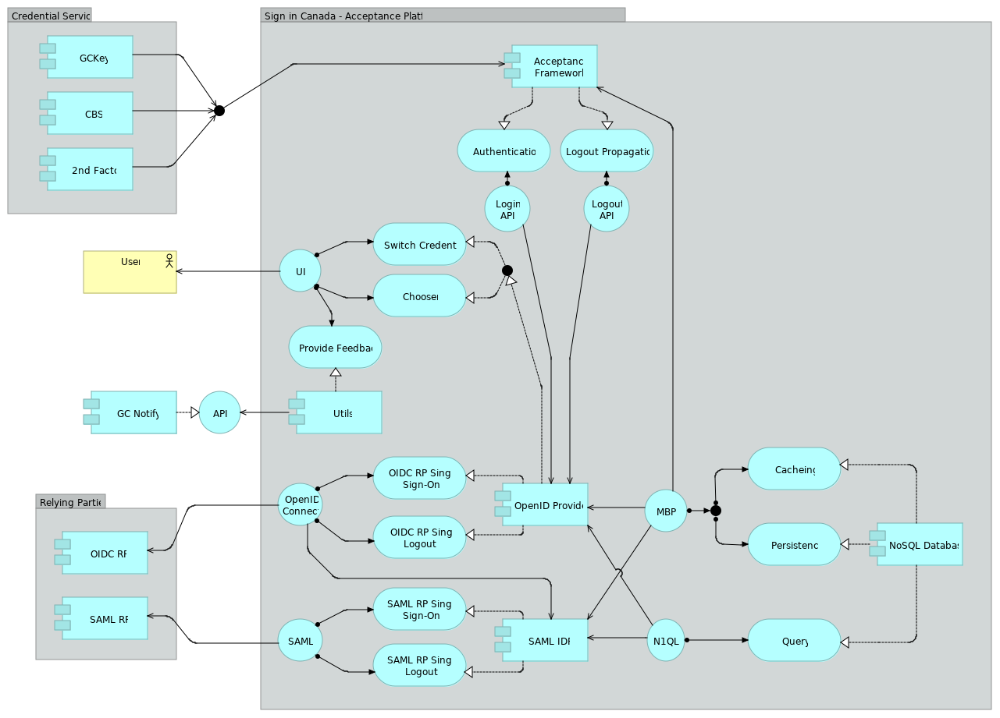

# Technologie et architecture

## Technologie

La plateforme Authenti-Canada est construite sur le [serveur Gluu (en anglais)](https://gluu.org), une plateforme de gestion de l’identité et de l’accès en source libre.

La plateforme tire également parti de plusieurs services infonuagiques:

* Infrastructure en tant que service : Machines virtuelles Azure, réseaux virtuels Azure, Gestionnaire de trafic Azure
* PaaS/SaaS : Azure Storage, Coffre de clés Azure, Azure Functions, Azure Surveillance (Perspectives sur l’application, analyse des journaux), Azure DevOps, Azure DevTest Labs, GitHub

## Architecture

## Composantes

### Cadre d’acceptation

Product: Gluu Passport (passeport pour Gluu)

Gluu Passport est une application Web [Node.JS](https://nodejs.org/fr/about/) basée sur le cadre 
d’application Web [Express](http://expressjs.com/fr/) et le logiciel de configuration 
d’authentification [Passport.JS (en anglais)](http://www.passportjs.org/).

Comme le nom l’indique, il s’agit de la composante « Acceptation » de la plateforme d’acceptation. 
Elle s’intègre avec les fournisseurs de justificatifs d’identité et les fournisseurs d’identité de 
confiance afin d’accepter des garanties de justificatifs d’identité et de justificatifs d’identité 
au nom des parties utilisatrices du gouvernement du Canada.

Authenti-Canada utilise une version du Gluu Passport qui a été personnalisée pour prendre en charge 
certaines fonctionnalités uniques qui appuient la coexistence avec les anciens services de justificatifs 
d’identité de la fédération des justificatifs du gouvernement du Canada et leur transition, en particulier:

* Elle a été adaptée pour appuyer à la fois la préservation et la migration en temps réel des 
  identificateurs anonymes persistants (IAP) existants de l’utilisateur du fournisseur de justificatifs 
  d’identité (FJI) vers la plateforme d’acceptation, de sorte que la transition n’ait aucune incidence sur 
  l’inscription des utilisateurs finaux auprès des parties utilisatrices actuelles.
* Elle a été personnalisée pour appuyer la coordination des séances entre la plateforme d’acceptation et les FJI.

Version: 5.3

Site Web: https://www.gluu.org/ (en anglais)

Code source: https://github.com/sign-in-canada/gluu-passport/ (en anglais)

### Fournisseur OpenID

Produit: oxAuth

oxAuth est un fournisseur [OpenID Connect (en anglais)](https://openid.net/connect/) en source libre et un serveur 
d’autorisation [UMA](https://kantarainitiative.org/confluence/display/uma/Home).

oxAuth est la composante principale de la plateforme d’acceptation, responsable de l’interface utilisateur et de la 
logique opérationnelle. En tant que fournisseuse [OpenID Connect (en anglais)](https://openid.net/connect/), elle fournit 
également l’interface de programmation d’applications utilisée par les parties utilisatrices du gouvernement du Canada qui 
s’intègrent à l’aide d'[OpenID Connect (en anglais)](https://openid.net/connect/).

Version: 4.4.0

Site Web: https://www.gluu.org/ (en anglais)

Code source: https://github.com/GluuFederation/oxAuth/ (en anglais)

### Fournisseur d’identité SAML

Produit: Shibboleth IDP

Shibboleth est un fournisseur d’identité [SAML (en anglais)](https://wiki.oasis-open.org/security/FrontPage) qui fournit 
l’interface de programmation d’applications utilisée par les parties utilisatrices du gouvernement du Canada qui s’intègrent 
à l’aide de [SAML (en anglais)](https://wiki.oasis-open.org/security/FrontPage).

Version: 4.4.0

Site Web: https://www.shibboleth.net/products/identity-provider/ (en anglais)

Code source: https://wiki.shibboleth.net/confluence/display/DEV/Source+Code+Access/ (en anglais)

### Base de données NoSQL

Produit: Couchbase Enterprise Server

Couchbase Server est un logiciel de base de données NoSQL en source libre, distribuée et multimodèle axée sur les documents 
qui est optimisé pour les applications interactives.

La plateforme Authenti-Canada utilise Couchbase pour stocker les profils d’utilisateurs et les configurations des parties 
utilisatrices, ainsi que pour la mise en cache répartie et à rendement élevé de séances.

Version: 6.6.5

Site Web: https://www.couchbase.com/ (en anglais)
